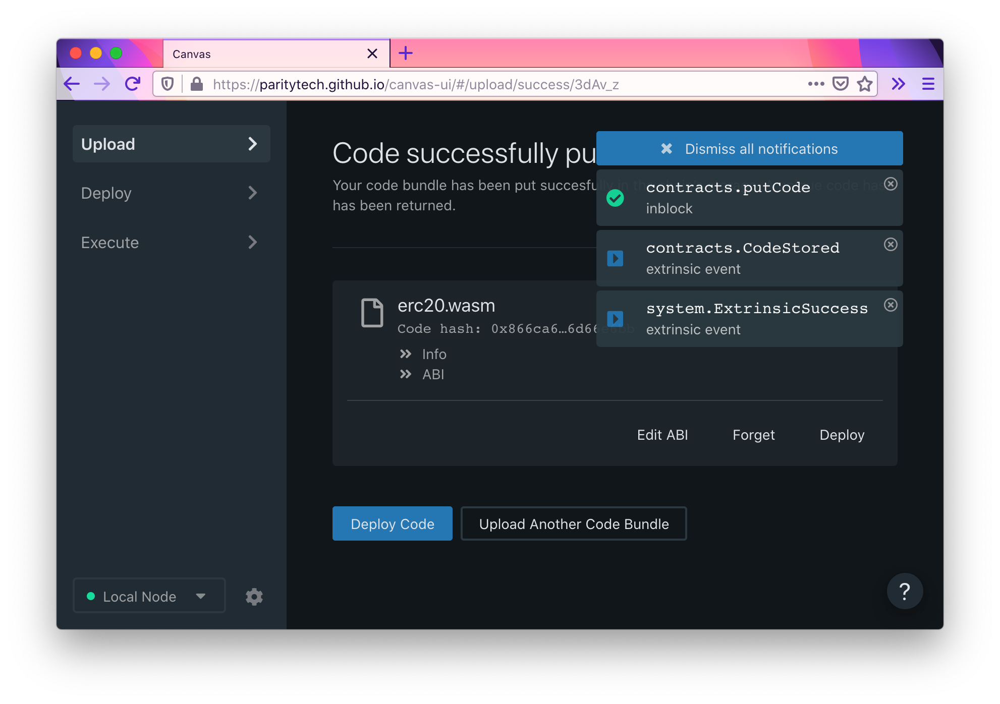
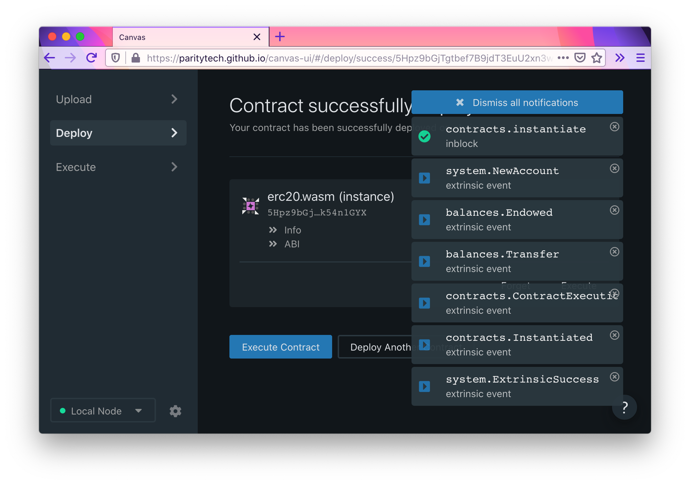
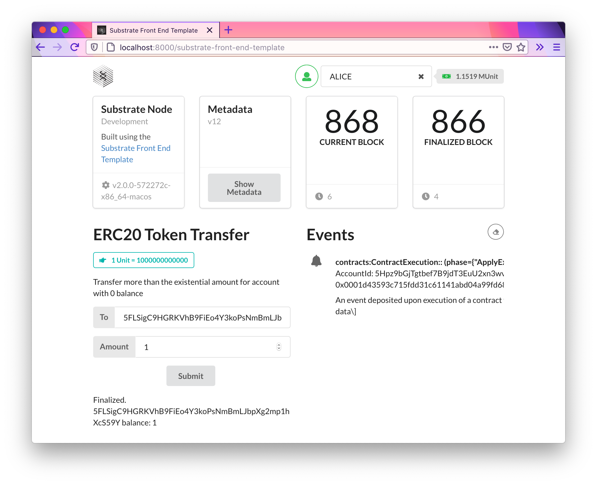

# Smart contracts - write an ERC-20 smart contract with ink!

## Source Code links

Smart contract code: https://github.com/BitAsh/ink-erc20-smart-contract

Substrate node with pallet contracts code: https://github.com/BitAsh/smart-contract-with-ink

Front end with ERC20 token transfer code: https://github.com/BitAsh/ink-erc20-front-end

## Screenshots

1. Upload smart contract success.

2. Deploy success.

3. Transfer success in front end UI.

