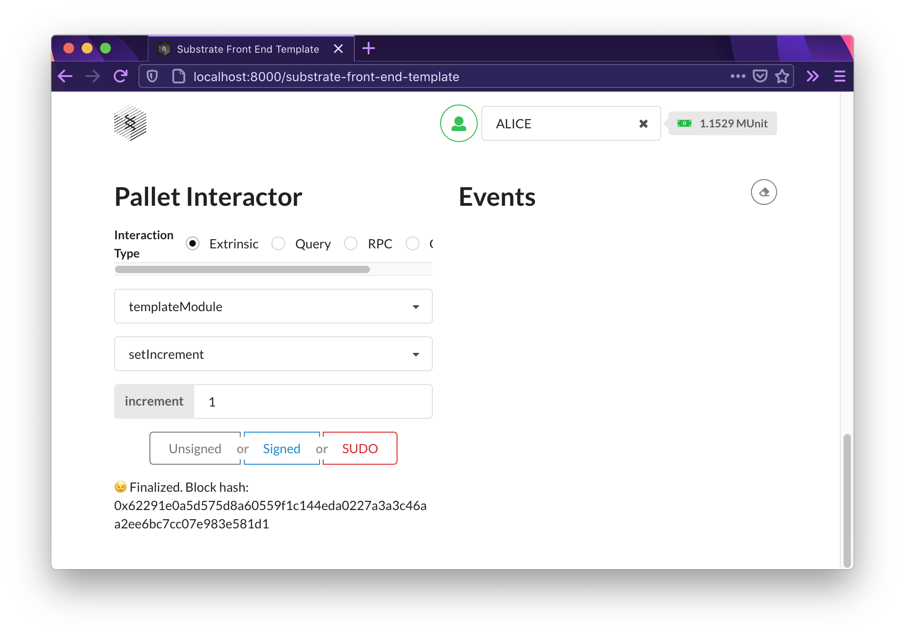
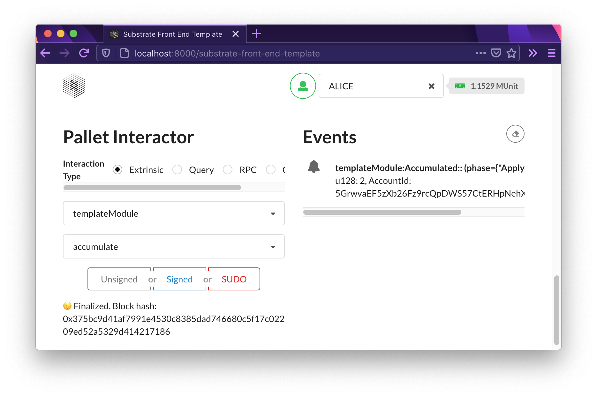

## FRAME Development

### Code

Node template with the updated pallet: https://github.com/BitAsh/frame-development

Updated front-end template: https://github.com/BitAsh/frame-development-front-end

### Proof of dispatchable call success

`setIncrement` call:

`accumulate` call:

