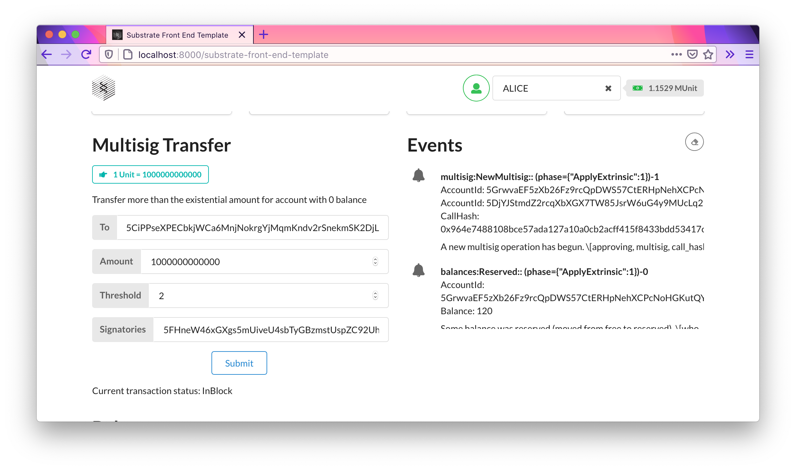
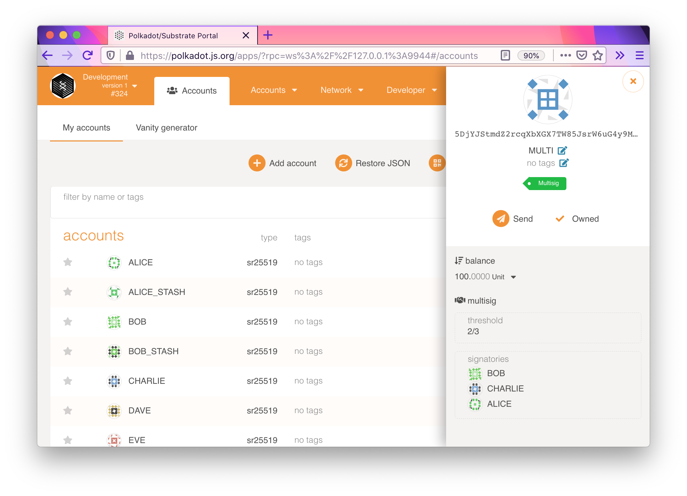

## FRAME Multisig

### Code

Node template with multisig pallet: https://github.com/BitAsh/substrate-multisig

Front-end with multisig transfer component: https://github.com/BitAsh/substrate-multisig-front-end

### Screenshots

Front-end component works:

The multisig:

